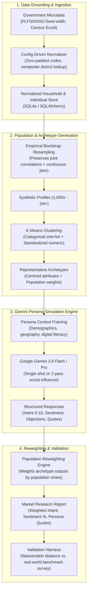

# Synthetic Market Research Engine for India

An AI-driven, statistically grounded market research engine designed to simulate how diverse Indian consumer demographics react to products, user interfaces, pricing models, and value propositions—without expensive real-world focus groups or ungrounded LLM guessing.

---

## Executive Summary

Traditional market research in India (field surveys, panels, focus groups) is slow (weeks to months), expensive, and difficult to run iteratively. Conversely, naive LLM prompting (*"Act as an Indian user"*) collapses into ungrounded stereotypes with no correlation to real demographics.

This platform bridges the gap with a **hybrid statistical sampling + machine learning + LLM architecture**:
1. Statistically samples millions of realistic synthetic Indian profiles preserving real demographic correlations (Census, NSSO/PLFS microdata).
2. Uses machine learning (K-Means) to compress the population into representative **archetypes**, each carrying an exact population frequency weight.
3. Prompts **Google Gemini** in-character for those archetypes to generate quantitative intent (0–10), sentiment, concrete objections, and authentic verbatim quotes.
4. Aggregates archetype responses through a **statistical reweighting engine** to calculate true market-wide adoption probability and sentiment distribution.
5. Verifies predictive accuracy using an empirical **validation harness** based on the 1-D Wasserstein metric against real-world sample responses.

---

## System Architecture



---

## The 5 Core Pipeline Stages

### 1. Data Grounding & Normalization (`app/data/etl/`)
* **Real Survey Sources**: Periodic Labour Force Survey (PLFS/NSSO) unit-level fixed-width files and Census District Handbook tables.
* **Normalizer**: Config-driven pipeline handling byte-range layouts, zero-padded code preservation, and composite state/district resolution (e.g. Karnataka district mapping).
* **Demographic Variables**: State, District, Urban/Rural, Household Income Band, Age, Gender, Education, Occupation, and Digital Access Score.

### 2. Population Generation (`app/simulation/population_generator.py`)
* Uses **empirical bootstrap resampling** directly from the empirical joint distribution of real survey data.
* Retains non-linear correlations (e.g., how income interacts with education level and digital literacy across urban vs. rural districts).
* Applies small continuous jitter to avoid duplicate profiles.

### 3. Machine Learning Clustering (`app/simulation/clustering.py`)
* Instead of running 5,000+ expensive LLM calls, **K-Means clustering** groups the population into $K$ representative archetypes (typically 10 to 150).
* Each archetype acts as a spokesperson for a market segment and carries a **`population_weight`** representing its exact percentage share of the country's target population.

### 4. Gemini Persona Simulation (`app/llm/`)
* Built with `langchain-google-genai` using **Gemini 3.6 Flash** (fast, free-tier friendly) or **Gemini 2.5 Pro**.
* **Single-shot persona chain**: Evaluates stimulus, returning purchase intent (0–10), sentiment, key objections, and in-character quotes.
* **Two-pass social influence graph** (LangGraph): Simulates peer word-of-mouth effects by presenting personas with aggregate peer reactions and tracking `intent_shift`.

### 5. Statistical Reweighting & Validation (`app/simulation/reweighting.py`, `app/validation/calibration.py`)
* **Reweighting**: Multiplies each archetype's score and sentiment by its `population_weight` to calculate the true aggregate market adoption metric.
* **Calibration**: Uses **Wasserstein distance** (Earth Mover's Distance) with population-weighted pseudo-frequency expansion to mathematically score alignment with real respondent survey samples.

---

## Technical Stack

| Component | Technology | Rationale |
| :--- | :--- | :--- |
| **API Framework** | FastAPI (Python 3.12) | Asynchronous endpoints, OpenAPI/Swagger UI, Pydantic validation |
| **Database** | SQLite + SQLAlchemy | Zero-dependency local setup on Windows; Postgres-compatible |
| **Task Queue** | FastAPI `BackgroundTasks` | Executes multi-archetype simulations without Redis or Celery |
| **LLM Engine** | Google Gemini (3.6 Flash / Pro) | High speed, generous free tier (15 RPM / 1,500 RPD), low cost |
| **Orchestration** | LangChain & LangGraph | Strict Pydantic output parsing and stateful multi-step decision graphs |
| **Data Science** | pandas, numpy, scikit-learn, scipy | Bootstrap resampling, K-Means clustering, Wasserstein metric |
| **Testing** | pytest (40 passing tests) | Full coverage of normalizer, sampling, clustering, reweighting, and API |

---

## Project Structure

```
Project/
├── README.md                          # Main project & architecture documentation
├── DATA_SOURCING_GUIDE.md             # Guide on downloading PLFS, Census & NFHS datasets
└── server/                            # Active, fully verified backend server
    ├── app/
    │   ├── api/routers/               # datasets, population, simulations, validation
    │   ├── core/                      # config.py (.env loading), database.py (SQLite)
    │   ├── data/                      # SQLAlchemy models & ETL normalizer
    │   ├── llm/                       # Gemini persona chain, LangGraph social influence
    │   ├── simulation/                # Population generator, K-Means clustering, reweighting
    │   ├── validation/                # Wasserstein distance calibration
    │   └── main.py                    # FastAPI app assembly with CORS & lifespan DB init
    ├── seed_data/                     # Synthetic demographic seed generator
    ├── seed_output/                   # Sample Census Excel, PLFS fixed-width, and seed CSVs
    ├── tests/                         # 40 comprehensive unit and integration tests
    ├── requirements.txt               # Pinned dependencies
    ├── .env.example                   # Environment configuration template
    └── .env                           # Local configuration with GEMINI_API_KEY
```

---

## Quickstart Guide

### 1. Environment Setup
```powershell
cd server
python -m venv venv
.\venv\Scripts\Activate.ps1
pip install -r requirements.txt
```

### 2. Configure Environment (`server/.env`)
```env
DATABASE_URL=sqlite:///./synth_research.db
GEMINI_API_KEY=your_gemini_api_key_here
GEMINI_MODEL=gemini-3.6-flash
LANGCHAIN_TRACING_V2=false
```

### 3. Run Automated Tests
```powershell
.\venv\Scripts\pytest.exe tests/ -v
# 40 passed in ~6 seconds
```

### 4. Start the Server
```powershell
uvicorn app.main:app --reload --port 8000
```
Open your browser at **`http://127.0.0.1:8000/docs`** for the interactive Swagger dashboard.

---

## Live Simulation Example

Testing a concept: **"A UPI-based micro-investment app where users can start saving in digital gold with as little as 10 rupees per day"**

### Aggregated Results:
* **Population Purchase Intent**: **`3.75 / 10`**
* **Sentiment Distribution**: `27.3% Positive`, `38.1% Neutral`, `34.6% Negative`

### Segment Breakdown & Quotes:
* **Urban, High Digital Literacy Segment (Weight: 27.3%)**:
  > **Intent**: 7/10 *(Positive)*  
  > **Quote**: *"Saving 10 rupees daily through UPI is a very practical idea for disciplined wealth building, but I need full transparency on buy-sell margins and safety regulations before trusting a digital gold app."*  
  > **Objection**: Spread rates and SEBI/RBI oversight.
* **Semi-Urban / Conservative Segment (Weight: 38.1%)**:
  > **Intent**: 3/10 *(Neutral)*  
  > **Quote**: *"Saving 10 rupees a day for gold sounds nice, but real gold is something I can hold in my hands or buy from our trusted village jeweler, not keep on a mobile screen."*  
  > **Objection**: Difficulty trusting digital gold compared to physical bullion.
* **Rural, Low Digital Access Segment (Weight: 34.6%)**:
  > **Intent**: 2/10 *(Negative)*  
  > **Quote**: *"How can gold be inside a mobile phone? I don't know how to use these online apps properly, and if my money disappears, who will I go ask in my village?"*  
  > **Objection**: Smartphone unfamiliarity and fear of digital transaction loss.
