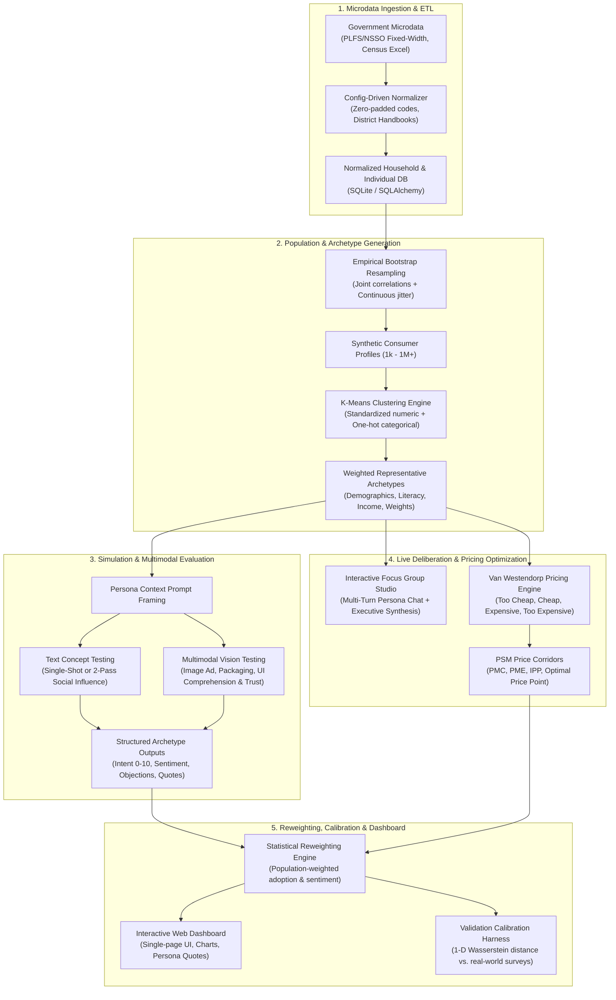

# Synthetic Market Research Engine for India

An AI-driven, statistically grounded consumer intelligence engine designed to simulate how diverse Indian demographics react to products, advertising creatives, user interfaces, pricing models, and value propositions—without expensive real-world focus groups or ungrounded LLM guessing.

---

## Executive Summary

Traditional market research in India (field surveys, panels, focus groups) is slow (4 to 8 weeks), expensive (Rs. 5,00,000 to Rs. 25,00,000 per study), and difficult to run iteratively. Conversely, naive LLM prompting (*"Act as an Indian consumer"*) collapses into ungrounded stereotypes with no empirical correlation to real demographics.

This platform bridges the gap with a **hybrid statistical sampling + machine learning + LLM architecture**:
1. **Statistically Samples** millions of realistic synthetic Indian consumer profiles preserving empirical demographic correlations (Census of India, NSSO / PLFS microdata).
2. **Compresses Personas** via machine learning (K-Means) into representative **archetypes**, each carrying an exact population frequency weight.
3. **Simulates Grounded Decisions** using **Google Gemini** in-character across quantitative intent (0–10), sentiment, concrete objections, and authentic verbatim vernacular quotes.
4. **Evaluates Visual Creatives** via multimodal computer vision, scoring visual comprehension, trust, visual hooks, and UI friction.
5. **Enables Live Deliberation** in an interactive Virtual Focus Group Studio with one-click Executive AI synthesis.
6. **Optimizes Pricing** through the Van Westendorp Price Sensitivity Meter (PSM), generating psychological pricing corridors.
7. **Aggregates Market Adoption** through a statistical reweighting engine and verifies predictive accuracy via an empirical Wasserstein calibration harness.

---

## System Architecture



---

## Core Platform Capabilities

### 1. High-Speed Persona Simulation & Social Contagion (`app/llm/persona_chain.py`, `app/llm/persona_graph.py`)
* Grounded personas evaluate business stimuli, returning purchase intent (0–10), sentiment, specific objections, and authentic verbatim quotes.
* **Two-Pass Social Influence Graph (LangGraph)**: Simulates word-of-mouth dynamics by exposing personas to aggregate peer reactions, capturing realistic social contagion and intent shifts.

### 2. Multimodal Visual Ad & Creative Testing (`app/llm/multimodal_chain.py`, `POST /simulations/multimodal/run`)
* Allows marketing and product teams to upload banner ads, packaging designs, or UI mockups alongside text descriptions.
* Evaluates multimodal visual comprehension, perceived visual trust, the first visual hook that caught the persona's eye, UI friction points, and objections.

### 3. Interactive Virtual Focus Group Studio (`app/llm/focus_group_chain.py`, `/focus-group/`)
* Facilitates real-time, multi-turn focus group discussions between a human moderator and synthetic Indian personas.
* Personas converse with each other in character, reacting to arguments and clarifying perspectives.
* **One-Click Executive Synthesis**: Generates structured executive debriefs with key takeaways, consensus points, divergence/debates, and strategic action recommendations.

### 4. "Goldilocks" Pricing Optimizer (`app/simulation/pricing_psm.py`, `/pricing/`)
* Implements the **Van Westendorp Price Sensitivity Meter (PSM)** using 4 psychological price questions:
  * *Too Cheap*: Doubts quality; refuses to purchase.
  * *Cheap (Bargain)*: Great value for money.
  * *Expensive*: High price, but still considered.
  * *Too Expensive*: Prohibitive; will not purchase.
* Computes cumulative psychological curves to establish:
  * **Point of Marginal Cheapness (PMC)**
  * **Point of Marginal Expensiveness (PME)**
  * **Indifference Price Point (IPP)**
  * **Optimal Price Point (OPP)**
  * **Recommended Acceptable Price Range**

### 5. Empirical Validation & Calibration (`app/validation/calibration.py`, `/validation/`)
* Quantifies accuracy against real-world human survey benchmarks using the **1-D Wasserstein Distance** (Earth Mover's Distance).
* Performs population-weighted pseudo-frequency expansion to ensure rigorous mathematical comparability.

### 6. Interactive Web Dashboard (`dashboard.html`)
* Complete single-page client interface built with modern vanilla JavaScript and CSS.
* Supports generating populations, running text and multimodal simulations, inspecting archetype quotes, and exploring pricing curves directly from the browser.

---

## Technical Stack

| Component | Technology | Rationale |
| :--- | :--- | :--- |
| **Backend API** | FastAPI (Python 3.12) | High-performance asynchronous endpoints, OpenAPI / Swagger documentation, Pydantic v2 schemas |
| **Database** | SQLite + SQLAlchemy ORM | Zero-dependency local persistence on Windows; portable and postgres-compatible |
| **Task Queue** | FastAPI `BackgroundTasks` | Executes multi-archetype LLM simulations and image processing asynchronously |
| **LLM Engine** | Google Gemini (3.6 Flash / 2.5 Pro) | Sub-second latency, generous free tier, multimodal vision support, cost-effective scaling |
| **Orchestration** | LangChain & LangGraph | Strict Pydantic output parsing, structured persona chains, and stateful multi-step social graphs |
| **Data Science** | pandas, numpy, scikit-learn, scipy | Empirical bootstrap sampling, K-Means clustering, cumulative PSM curves, Wasserstein metric |
| **Frontend UI** | HTML5, CSS3, Vanilla JS (`dashboard.html`) | Lightweight, self-contained dashboard requiring no build step or node_modules |
| **Automated Testing** | pytest (50 passing tests) | 100% passing test coverage across ETL, clustering, multimodal, focus group, and pricing engines |

---

## Project Directory Structure

```
Market-Research/
├── README.md                                  # Complete platform & architecture documentation
├── DATA_SOURCING_GUIDE.md                     # Microdata acquisition guide (PLFS, Census, NFHS)
├── FUTURE_ROADMAP.md                          # Platform roadmap & long-term development milestones
├── dashboard.html                             # Interactive single-page web dashboard
├── sample_ad_creative.jpg                     # Sample multimodal ad banner for testing
├── synthetiq_pro_technical_report.tex         # Complete academic / enterprise technical report
└── server/                                    # Active, fully verified backend application
    ├── requirements.txt                       # Pinned Python package dependencies
    ├── synth_research.db                      # Local SQLite operational database
    ├── app/
    │   ├── main.py                            # FastAPI application assembly with CORS & lifespan DB init
    │   ├── api/
    │   │   └── routers/
    │   │       ├── datasets.py                # Dataset file upload and ETL ingestion
    │   │       ├── population.py              # Bootstrap population sampling & K-Means clustering
    │   │       ├── simulations.py             # Single-shot, social influence & multimodal vision testing
    │   │       ├── focus_group.py             # Virtual focus group sessions, messaging & synthesis
    │   │       ├── pricing.py                 # Van Westendorp PSM pricing simulation & curve analysis
    │   │       └── validation.py              # Wasserstein distance calibration against human benchmarks
    │   ├── core/
    │   │   ├── config.py                      # Environment configuration (.env loading)
    │   │   └── database.py                    # SQLAlchemy database engine and session management
    │   ├── data/
    │   │   ├── models.py                      # SQLAlchemy ORM database models
    │   │   └── etl/
    │   │       ├── ingest_census.py           # Census District Handbook parser
    │   │       ├── ingest_nsso.py             # PLFS/NSSO fixed-width microdata reader
    │   │       └── normalize_raw_dataset.py   # Code normalizer and district lookup resolver
    │   ├── llm/
    │   │   ├── gemini_client.py               # Google Gemini client initialization
    │   │   ├── persona_chain.py               # Single-shot in-character demographic simulation
    │   │   ├── persona_graph.py               # LangGraph 2-pass social contagion workflow
    │   │   ├── multimodal_chain.py            # Computer vision ad & UI evaluation chain
    │   │   ├── focus_group_chain.py           # Live focus group persona dialogue & executive synthesis
    │   │   └── prompts.py                     # Demographic persona prompt templates
    │   ├── schemas/                           # Pydantic v2 request/response validation schemas
    │   │   ├── datasets.py
    │   │   ├── population.py
    │   │   ├── simulation.py
    │   │   ├── focus_group.py
    │   │   ├── pricing.py
    │   │   └── validation.py
    │   ├── simulation/
    │   │   ├── population_generator.py        # Joint-distribution bootstrap resampler with jitter
    │   │   ├── clustering.py                  # K-Means archetype clustering and weight calculation
    │   │   ├── pricing_psm.py                 # Van Westendorp mathematical curve calculator
    │   │   └── reweighting.py                 # Population-weighted adoption & sentiment aggregation
    │   └── validation/
    │       └── calibration.py                 # Earth Mover's Distance calibration harness
    ├── seed_data/
    │   └── generate_seed_data.py              # Demographic synthetic seed generator
    ├── seed_output/                           # Pre-generated seed files (Census Excel, PLFS, CSVs)
    └── tests/                                 # 50 comprehensive unit and integration tests
        ├── test_api_endpoints.py              # API endpoint integration test suite
        ├── test_calibration.py                # Wasserstein calibration unit tests
        ├── test_clustering.py                 # K-Means clustering and weighting tests
        ├── test_focus_group.py                # Focus group dialogue and synthesis tests
        ├── test_multimodal_simulation.py      # Multimodal visual evaluation tests
        ├── test_normalize_raw_dataset.py      # ETL and normalization tests
        ├── test_persona_graph_logic.py        # LangGraph social influence logic tests
        ├── test_population_generator.py       # Bootstrap sampling and distribution tests
        ├── test_pricing.py                    # Van Westendorp PSM curve computation tests
        └── test_reweighting.py                # Statistical reweighting aggregation tests
```

---

## API Endpoints Reference

### Datasets (`/datasets`)
* `POST /datasets/ingest`: Upload and ingest Census Excel or PLFS fixed-width files into SQLite.
* `GET /datasets/sources`: List supported data sources (`census`, `nsso`).

### Population & Archetypes (`/population`)
* `POST /population/generate`: Sample $N$ synthetic profiles and cluster into $K$ representative archetypes.
* `GET /population/{run_id}/archetypes`: Retrieve clustered archetypes with demographic centroid attributes and population weights.

### Consumer Simulations (`/simulations`)
* `POST /simulations/run`: Initiate text-based simulation across archetypes (optional 2-pass social influence).
* `POST /simulations/multimodal/run`: Upload creative image + text stimulus for multimodal persona evaluation.
* `GET /simulations/{run_id}/status`: Poll execution status (`pending`, `running`, `completed`, `failed`).
* `GET /simulations/{run_id}/results`: Retrieve population-weighted adoption metrics, sentiment breakdown, friction points, and quotes.

### Live Focus Group Studio (`/focus-group`)
* `POST /focus-group/sessions`: Initialize a virtual focus group room for a target topic with sampled personas.
* `GET /focus-group/sessions/{session_id}`: Fetch session history, participant list, and messages.
* `POST /focus-group/sessions/{session_id}/message`: Post a moderator question or prompt persona replies.
* `POST /focus-group/sessions/{session_id}/synthesize`: Run executive AI synthesis on session transcript.

### Pricing Optimization (`/pricing`)
* `POST /pricing/van-westendorp/run`: Run 4-question PSM simulation to calculate price sensitivity curves and optimal price points.
* `GET /pricing/simulations/{run_id}`: Retrieve stored pricing run details, curves, and strategic recommendations.

### Validation & Benchmark Calibration (`/validation`)
* `POST /validation/compare`: Compute 1-D Wasserstein distance comparing simulation intent distribution against real-world survey CSV.
* `GET /validation/{run_id}/history`: Retrieve historical calibration runs and accuracy scores.

### Health Check (`/health`)
* `GET /health`: Returns service operational status (`{"status": "ok"}`).

---

## Commercial Unit Economics & SaaS Pricing

The platform implements an **Upfront Prepaid Credit Architecture** where customers purchase monthly plans or one-off credit packs before initiating simulations. Usage is denominated in intuitive credits rather than raw LLM tokens.

### Subscription Tiers (in INR)

| Plan Tier | Monthly Allowance | Effective Rate | Selling Price (INR) | Compute OpEx | Gross Margin |
| :--- | :--- | :--- | :--- | :--- | :--- |
| **Starter** | 100 Credits / month | Rs. 49.99 / credit | Rs. 4,999 / mo | ~Rs. 12.00 | **99.7%** |
| **Growth** | 400 Credits + Vision | Rs. 37.49 / credit | Rs. 14,999 / mo | ~Rs. 48.00 | **99.7%** |
| **Enterprise** | 1,500 Credits + Custom Slices | Rs. 33.33 / credit | Rs. 49,999 / mo | ~Rs. 185.00 | **99.6%** |
| **Add-On Pack** | 50 One-Time Credits | Rs. 29.98 / credit | Rs. 1,499 one-off | ~Rs. 6.00 | **99.6%** |

### Why Software Gross Margins Exceed 99%
* **Enterprise Value**: Decision-makers use these simulations to de-risk multi-crore marketing campaigns and product launches.
* **Microscopic Compute Cost**: Processing a full 4-archetype simulation on Google Gemini Flash costs under Rs. 0.15 in raw token compute.
* **The Value Arbitrage**: The large spread between high enterprise utility and microscopic compute cost establishes an enduring 99%+ gross margin moat.

---

## Quickstart Guide

### 1. Environment Setup (Windows PowerShell)

```powershell
cd server
python -m venv venv
.\venv\Scripts\Activate.ps1
pip install -r requirements.txt
```

### 2. Configure Environment (`server/.env`)

```env
DATABASE_URL=sqlite:///./synth_research.db
GEMINI_API_KEY=your_gemini_api_key_here
GEMINI_MODEL=gemini-3.6-flash
LANGCHAIN_TRACING_V2=false
```

### 3. Run Automated Tests

```powershell
.\venv\Scripts\pytest.exe tests/ -v
# 50 passed in ~7 seconds
```

### 4. Start the Backend API

```powershell
uvicorn app.main:app --reload --port 8000
```

* Interactive OpenAPI / Swagger Documentation: **`http://127.0.0.1:8000/docs`**
* Interactive Web Dashboard: Open **`dashboard.html`** directly in any modern browser.

---

## Case Study: UPI Micro-Investment Digital Gold

Testing the concept: *"A UPI-based micro-investment app where users can start saving in digital gold with as little as 10 rupees per day"* alongside creative banner testing.

### Aggregate Market Adoption Metrics
* **Market-Wide Purchase Intent**: **`3.75 / 10`**
* **Sentiment Distribution**: `27.3% Positive`, `38.1% Neutral`, `34.6% Negative`
* **Visual Comprehension Score**: `7.5 / 10` | **Visual Trust Score**: `5.8 / 10`

### Archetype Segment Breakdown & Verbatim Quotes

* **Urban, High Digital Literacy Segment (Weight: 27.3%)**:
  > **Intent**: 7/10 *(Positive)*  
  > **Quote**: *"Saving 10 rupees daily through UPI is a very practical idea for disciplined wealth building, but I need full transparency on buy-sell spreads and SEBI/RBI oversight before committing substantial funds."*  
  > **Key Objection**: Spread margins and institutional regulatory clarity.

* **Semi-Urban / Conservative Segment (Weight: 38.1%)**:
  > **Intent**: 3/10 *(Neutral)*  
  > **Quote**: *"Saving 10 rupees a day for gold sounds nice, but real gold is something I can hold in my hands or buy from our trusted family jeweler, not keep as numbers on a mobile screen."*  
  > **Key Objection**: Strong preference for physical gold and local jeweler relationships.

* **Rural, Low Digital Access Segment (Weight: 34.6%)**:
  > **Intent**: 2/10 *(Negative)*  
  > **Quote**: *"How can gold be inside a mobile phone? I don't know how to use these online apps properly, and if my money disappears, who will I go ask in my village?"*  
  > **Key Objection**: Smartphone interface unfamiliarity and fear of digital payment fraud.

---

## License & Operational Guidelines
This project is proprietary and confidential. Developed for enterprise synthetic market research and consumer intelligence across the Indian demographic landscape.
