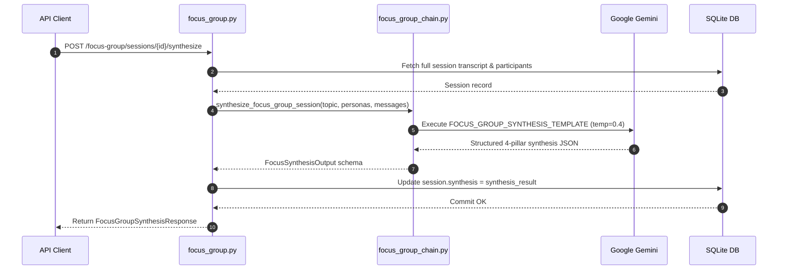

# Virtual Focus Group Engine: Backend Architecture & Workflow Specification

## 1. Executive Summary & Purpose

Traditional consumer focus groups in India suffer from severe operational bottlenecks:
* High recruitment friction and scheduling delays across geographically diverse demographic cohorts.
* Prohibitive costs (₹5,00,000 to ₹15,00,000 per multi-city study).
* Dominant-speaker bias, where vocal metro participants intimidate quieter non-metro attendees.
* Static one-shot surveys fail to capture conversational nuance, spontaneous counter-arguments, and emotional subtext.

The **Virtual Focus Group Engine** is an API-first backend system providing stateful, multi-turn conversational rooms. A moderator client (e.g., product manager, researcher, or automated agent) initializes a research topic and convenes a live panel of synthetic Indian consumer personas grounded in empirical demographic clusters. Personas converse in character, answer moderator questions, react to peer remarks, and can be synthesized on demand into an executive research debrief.

---

## 2. System Architecture & End-to-End Backend Workflow

```mermaid
flowchart TD
    subgraph Client ["Client Layer"]
        App["API Client / Moderator Console / External Agent"]
    end

    subgraph API ["FastAPI Router (api/routers/focus_group.py)"]
        CreateRouter["POST /focus-group/sessions"]
        GetRouter["GET /focus-group/sessions/{session_id}"]
        MsgRouter["POST /focus-group/sessions/{session_id}/message"]
        SynthRouter["POST /focus-group/sessions/{session_id}/synthesize"]
    end

    subgraph Engine ["Focus Group Orchestration (llm/focus_group_chain.py)"]
        PersonaBuilder["generate_focus_group_personas()<br/>Maps centroids to authentic names, bios & weights"]
        TurnRunner["generate_persona_focus_reply()<br/>Context-Aware Multi-Turn LLM Chain"]
        FallbackEngine["Contextual Heuristic Fallback<br/>(Price, Trust, Competitor Heuristics)"]
        DebriefSynthesizer["synthesize_focus_group_session()<br/>4-Pillar Executive Synthesis Chain"]
    end

    subgraph DB ["Operational DB (data/models.py)"]
        T_Arch["archetypes table"]
        T_Session["focus_group_sessions table<br/>(personas, messages, synthesis)"]
    end

    App -->|POST /sessions (topic, run_id)| CreateRouter
    CreateRouter -->|Fetch demographic centroids| T_Arch
    CreateRouter --> PersonaBuilder
    PersonaBuilder -->|Persist active room| T_Session
    CreateRouter -->|Return session schema| App

    App -->|POST /message (text, target_id)| MsgRouter
    MsgRouter --> TurnRunner
    TurnRunner -->|LLM Failure?| FallbackEngine
    TurnRunner & FallbackEngine -->|Append messages| T_Session
    MsgRouter -->|Return new messages array| App

    App -->|POST /synthesize| SynthRouter
    SynthRouter --> DebriefSynthesizer
    DebriefSynthesizer -->|Save synthesis JSON| T_Session
    SynthRouter -->|Return 4-pillar debrief| App

    App -->|GET /sessions/{id}| GetRouter
    GetRouter -->|Read full transcript| T_Session
```

---

## 3. Detailed Backend Operational Workflows

### Workflow 1: Focus Group Session Initialization

**Primary Endpoint**: `POST /focus-group/sessions`  
**Backend Handler**: `create_focus_group_session()` in [`server/app/api/routers/focus_group.py`](file:///c:/Users/Dell/Desktop/Market-Research/server/app/api/routers/focus_group.py)

#### Step 1: Ingestion & Demographic Cluster Extraction
* Accepts `FocusGroupCreateRequest`:
  ```python
  class FocusGroupCreateRequest(BaseModel):
      topic: str
      population_run_id: str
      n_personas: Optional[int] = Field(default=4, ge=2, le=6)
  ```
* Queries the `archetypes` table to retrieve representative demographic centroids associated with `population_run_id`.
* Verifies that the demographic run exists and is populated.

#### Step 2: Dynamic Demographic Persona Synthesis
Executed in `generate_focus_group_personas()` ([`server/app/llm/focus_group_chain.py`](file:///c:/Users/Dell/Desktop/Market-Research/server/app/llm/focus_group_chain.py)):
* **Culturally Grounded Regional Names**: Pools authentic Indian male and female names (*Rajesh Sharma, Vikram Patel, Sunita Sharma, Ananya Sen, Lakshmi Narayanan, Deepak Mukherjee*).
* **Demographic Grounding**: Binds age, gender, occupation, location (district, state), household income tier, and digital access score from the archetype centroid.
* **Narrative Biography**: Generates a natural biographical summary grounding daily routine realities:
  > *"Sunita Sharma, 38, Female residing in Hubballi (Karnataka). Works as a Primary School Teacher in a Semi-Urban setting with 25k–50k monthly household income. Digital access index: 0.6."*
* **Weight Normalization**: Normalizes population weights across the active panel so they sum to $1.0$.

#### Step 3: Welcome Message & Session State Persistence
* Instantiates an initial system welcome message:
  ```json
  {
    "id": "2d1b827e-4ea7-4ce8-8be4-8f0a7cb25e21",
    "sender_type": "system",
    "sender_id": "system",
    "sender_name": "Focus Room Host",
    "message": "Welcome everyone to today's focus group. We are exploring the topic: 'Evaluating UPI Auto-Pay for monthly Kirana grocery credits'...",
    "sentiment": "neutral",
    "created_at": "2026-09-07T09:15:00Z"
  }
  ```
* Creates a `FocusGroupSession` database record with `status="active"`.
* Returns `FocusGroupSessionResponse` containing session ID, participant personas list, and initialized message log.

---

### Workflow 2: Conversational Multi-Turn Message Turn

**Primary Endpoint**: `POST /focus-group/sessions/{session_id}/message`  
**Backend Handler**: `post_focus_group_message()` in [`server/app/api/routers/focus_group.py`](file:///c:/Users/Dell/Desktop/Market-Research/server/app/api/routers/focus_group.py)

#### Step 1: Moderator Message Ingestion & Routing Logic
Accepts `FocusGroupMessageRequest`:
```python
class FocusGroupMessageRequest(BaseModel):
    message: str
    target_persona_id: Optional[str] = None
```
* Generates a new message item for the moderator and appends it to the session record.
* **Participant Routing**:
  * If `target_persona_id` is provided, only the targeted persona generates a reply.
  * If `target_persona_id` is omitted/null, all personas in the room generate replies sequentially.

#### Step 2: Context Sliding Window Assembly
To prevent LLM context bloat and token exhaustion during extended discussions, `generate_persona_focus_reply()` extracts the last 6 messages from the room's conversation history:
```python
formatted_history_list = []
for msg in conversation_history[-6:]:
    sender = msg.get("sender_name", "Moderator")
    text = msg.get("message", "")
    formatted_history_list.append(f"{sender}: {text}")
history_str = "\n".join(formatted_history_list)
```

#### Step 3: Dynamic Conversational Prompt Assembly
Injects the context into `FOCUS_GROUP_PERSONA_TEMPLATE` ([`server/app/llm/prompts.py`](file:///c:/Users/Dell/Desktop/Market-Research/server/app/llm/prompts.py)):
* Supplies the persona's full identity, occupation, income realities, and location.
* Instructs the model to speak naturally (2–4 sentences) in character as an Indian consumer.
* Allows personas to react directly to statements made by fellow participants in the room, creating authentic peer debate.

#### Step 4: LLM Inference & Structured Parsing
* Executes Gemini (`gemini-3.6-flash`, temperature 0.7).
* Parses the output using `PydanticOutputParser(FocusPersonaReply)`:
  * `reply`: Conversational text response.
  * `sentiment`: `"positive" | "neutral" | "negative" | "mixed"`.

#### Step 5: Heuristic Topical Fallback Engine
If an LLM API error or timeout occurs, `build_fallback_persona_reply()` generates demographic-specific, topic-sensitive responses based on keyword analysis of the user prompt:
* **Pricing & Cost Keywords**: Lower-income personas emphasize household budget scrutiny; higher-income personas scrutinize quality and uptime.
* **Trust & Security Keywords**: Low digital-literacy personas demand local face-to-face support; high-literacy personas emphasize transparent refund policies.
* **Competitor & Local Habit Keywords**: Responds with established local offline routines (e.g., informal Kirana credit).

#### Step 6: Atomic Database Persistence & Commit
* Appends both the moderator message and the generated persona responses to `FocusGroupSession.messages`.
* Commits the transaction and returns the array of newly added `FocusGroupMessageItem` records.

---

### Workflow 3: Executive AI Synthesis Engine

**Primary Endpoint**: `POST /focus-group/sessions/{session_id}/synthesize`  
**Backend Handler**: `synthesize_session_insights()` in [`server/app/api/routers/focus_group.py`](file:///c:/Users/Dell/Desktop/Market-Research/server/app/api/routers/focus_group.py)



#### Step 1: Full Transcript Compilation & Roster Assembly
* Formats all participant demographic summaries.
* Compiles the entire chronological chat transcript into an end-to-end conversation document.

#### Step 2: Synthesis Execution & Output Parsing
* Invokes Gemini with `FOCUS_GROUP_SYNTHESIS_TEMPLATE` using lower temperature ($0.4$) for analytical precision.
* Extracts the 4 core pillars using `PydanticOutputParser(FocusSynthesisOutput)`:
  1. **`key_takeaways`**: 3–4 high-impact bullets summarizing the dominant attitudes in the room.
  2. **`consensus_points`**: Unanimous or near-unanimous perspectives (e.g., universal insistence on zero hidden cancellation fees).
  3. **`divergence_points`**: Demographic conflicts and trade-offs (e.g., metro salaried professionals favoring digital auto-debit vs. non-metro shopkeepers demanding manual cash approval).
  4. **`strategic_recommendations`**: Concrete action items for product managers, UI/UX designers, and go-to-market teams.

#### Step 3: Synthesis Persistence
* Saves the resulting JSON into the `focus_group_sessions.synthesis` column.
* Returns `FocusGroupSynthesisResponse` to the caller.

---

### Workflow 4: Session Inspection & Retrieval

**Endpoint**: `GET /focus-group/sessions/{session_id}`  
**Response Model**: `FocusGroupSessionResponse`

```json
{
  "id": "4a123f4b-8e21-4f10-bce5-876123456789",
  "topic": "Evaluating UPI Auto-Pay for monthly Kirana grocery credits",
  "population_run_id": "7b0a8806-0fc2-4fc8-9f20-802521c7ffcb",
  "status": "active",
  "personas": [
    {
      "id": "persona_1_a7b29c",
      "name": "Rajesh Sharma",
      "age": 34,
      "gender": "Male",
      "occupation": "salaried_private",
      "location": "Pune, Maharashtra",
      "income_band": "25k-50k",
      "digital_access_score": 0.72,
      "bio": "Rajesh Sharma, 34, Male residing in Pune (Maharashtra)...",
      "avatar_color": "#6366F1",
      "population_weight": 0.284
    }
  ],
  "messages": [
    {
      "id": "msg_01",
      "sender_type": "moderator",
      "sender_id": "moderator",
      "sender_name": "Moderator",
      "message": "Would you allow recurring automatic deductions from your bank account?",
      "sentiment": null,
      "created_at": "2026-09-07T09:20:00Z"
    },
    {
      "id": "msg_02",
      "sender_type": "persona",
      "sender_id": "persona_1_a7b29c",
      "sender_name": "Rajesh Sharma",
      "message": "For our household, automatic deduction is fine only if there is an instant SMS alert 24 hours prior.",
      "sentiment": "neutral",
      "created_at": "2026-09-07T09:20:03Z"
    }
  ],
  "synthesis": null
}
```

---

## 4. Database Schema Specifications

### `focus_group_sessions` Table
| Column Name | SQLAlchemy Type | Constraints | Description |
| :--- | :--- | :--- | :--- |
| `id` | `String` | Primary Key, Index | Session UUID |
| `topic` | `String` | Not Null | Research question / concept topic |
| `population_run_id` | `String` | Index, Not Null | Associated demographic sampling run ID |
| `status` | `String` | Default="active" | Session status: `active`, `completed` |
| `personas` | `JSON` | Not Null | Array of participant persona metadata |
| `messages` | `JSON` | Default=list | Chronological list of message objects |
| `synthesis` | `JSON` | Nullable | Stored 4-pillar executive debrief |

---

## 5. Defensive Engineering & Reliability Guarantees

1. **Sliding Window Token Protection**: By restricting conversational history injection to the last 6 messages, token consumption remains constant regardless of whether the session spans 5 turns or 50 turns.
2. **Deterministic Contextual Fallback Engine**: If Gemini experiences transient network timeouts, `build_fallback_persona_reply()` generates demographic-specific, topic-grounded responses, preventing conversational deadlocks.
3. **Transactional Persistence**: Messages are appended atomically to SQLite upon every turn, guaranteeing that client disconnects never compromise conversation history.
