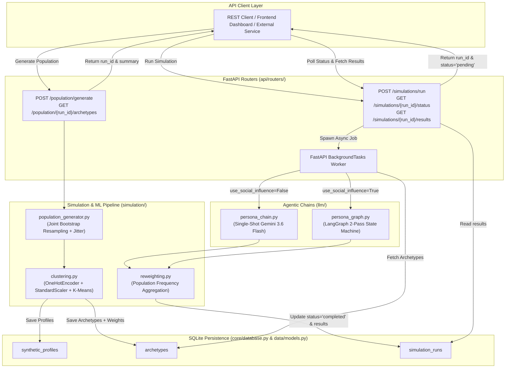
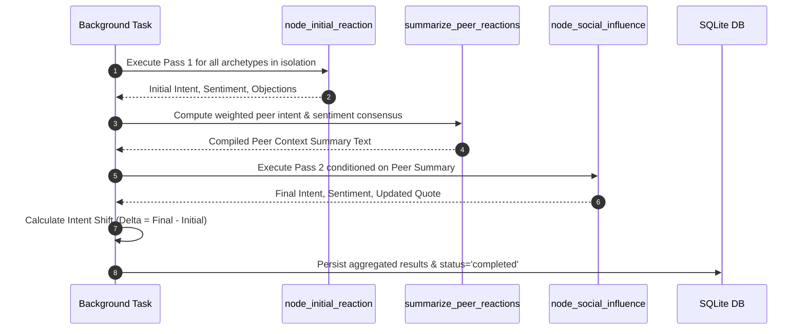

# Market Simulation Engine: Backend Architecture & Workflow Specification

## 1. Executive Summary & Purpose

The **Market Simulation Engine** is the core simulation subsystem of the synthetic market research platform. It addresses the fundamental flaw of conventional market research in India: field surveys and human panels are slow (4 to 8 weeks) and expensive (₹5,00,000–₹25,00,000 per study), while naive LLM prompting (*"Act as an Indian consumer"*) collapses into ungrounded cultural stereotypes without demographic validity.

The engine solves this through a **headless, API-first architecture** combining empirical microdata sampling, machine learning clustering, Google Gemini LLM reasoning, multi-agent social contagion modeling (LangGraph), and demographic frequency reweighting. Any frontend interface, API gateway, or data science workflow communicates with this subsystem exclusively through RESTful endpoints.

---

## 2. System Architecture & End-to-End Backend Workflow



---

## 3. Detailed Backend Operational Workflows

### Workflow 1: Population Sampling & Archetype Compression

**Primary Endpoint**: `POST /population/generate`  
**Backend Handler**: `generate_population()` in [`server/app/api/routers/population.py`](file:///c:/Users/Dell/Desktop/Market-Research/server/app/api/routers/population.py)

#### Step 1: Request Ingestion & Schema Validation
The endpoint receives a `PopulationRequest` payload:
```python
class PopulationRequest(BaseModel):
    n: int = 100000             # Default: 100,000 synthetic profiles (can be set to e.g. 1,000 for rapid tests)
    n_archetypes: int = 150     # Default: 150 K-Means clusters (can be set to e.g. 4 for low-latency simulation)
    seed: int = 42              # Seed for reproducible random sampling
```

#### Step 2: Base Demographic Extraction & Seed Fallback
The handler invokes `build_conditional_distributions(database_session)`:
* Executes SQL joining `households` and `individuals`:
  ```sql
  SELECT h.state, h.urban_rural, h.income_band, i.age, i.gender,
         i.education, i.occupation, i.digital_access_score
  FROM households h 
  JOIN individuals i ON i.household_id = h.id
  ```
* **Production Baseline (Operational DB)**: The SQLite operational database (`server/synth_research.db`) is primed with **50,000 households**, **152,201 real adult individuals** from MoSPI PLFS 2025 across all 36 States/UTs and 771 districts, and 1,280 Census 2011 district rows via `app/data/etl/ingest_real_plfs_and_census.py` (reading from `data/`).
* **Fallback Guarantee**: If the operational database is initialized in a clean CI/CD or staging environment with no ingested survey rows, the handler automatically detects the empty state and falls back to pre-seeded microdata from `seed_output/seed_households.csv` and `seed_individuals.csv`, executing `join_seed_data()`.

#### Step 3: Empirical Joint-Distribution Bootstrap Resampling
Executed in `sample_synthetic_population()` ([`server/app/simulation/population_generator.py`](file:///c:/Users/Dell/Desktop/Market-Research/server/app/simulation/population_generator.py)):
* Avoids independent variable assumptions by drawing random row vectors with replacement:
  $$\mathbf{x}_i \sim \hat{F}_{\text{joint}}(\text{state}, \text{urban\_rural}, \text{income\_band}, \text{age}, \text{gender}, \text{education}, \text{occupation}, \text{digital\_access})$$
* **Continuous Jittering**: Prevents duplicate clone rows by applying continuous Gaussian and discrete uniform jitter:
  $$\text{digital\_access\_score} \leftarrow \text{clip}\left(\text{score} + \mathcal{N}(0, 0.02^2), 0.0, 1.0\right)$$
  $$\text{age} \leftarrow \text{clip}\left(\text{age} + \mathcal{U}\{-1, 0, 1\}, 18, 100\right)$$

#### Step 4: Persistence of Raw Synthetic Profiles
The sampled DataFrame is converted into `SyntheticProfile` ORM records and bulk-inserted into the database via `persist_population()`:
```python
records = [
    SyntheticProfile(run_id=run_id, attributes=json.loads(row.to_json()))
    for _, row in population_dataframe.iterrows()
]
database_session.bulk_save_objects(records)
database_session.commit()
```

#### Step 5: Machine Learning Archetype Clustering
Executed in `build_archetypes()` ([`server/app/simulation/clustering.py`](file:///c:/Users/Dell/Desktop/Market-Research/server/app/simulation/clustering.py)):
* **Pre-processing via `ColumnTransformer`**:
  * Categorical features (`state`, `urban_rural`, `income_band`, `gender`, `education`, `occupation`) are encoded using `OneHotEncoder(handle_unknown="ignore")`.
  * Numerical features (`age`, `digital_access_score`) are normalized using `StandardScaler()`.
* **K-Means Clustering**:
  Fits a `KMeans(n_clusters=n_archetypes, random_state=seed, n_init=10)` model on the transformed feature space.
* **Demographic Population Weighting**:
  Computes the empirical cluster frequency weight $w_k$ representing the exact proportion of the sampled population mapped to cluster $k$:
  $$w_k = \frac{N_k}{N} \quad \text{where} \quad \sum_{k=1}^K w_k = 1.0$$
* Extracts representative centroid attributes for each cluster.

#### Step 6: Archetype Database Persistence & Response
* Inserts $K$ records into the `archetypes` table containing `centroid_attributes` and `population_weight`.
* Commits the transaction and returns:
  ```json
  {
    "run_id": "7b0a8806-0fc2-4fc8-9f20-802521c7ffcb",
    "n_generated": 1000,
    "n_archetypes": 4
  }
  ```

---

### Workflow 2: Single-Shot Demographic Concept Simulation

**Primary Endpoint**: `POST /simulations/run` (with `use_social_influence=False`)  
**Backend Handler**: `start_simulation()` in [`server/app/api/routers/simulations.py`](file:///c:/Users/Dell/Desktop/Market-Research/server/app/api/routers/simulations.py)

#### Step 1: Ingestion, Validation & Background Dispatch
* Validates `SimulationRequest`:
  ```python
  class SimulationRequest(BaseModel):
      stimulus_description: str
      population_run_id: str
      use_social_influence: bool = False
      n_archetypes_override: Optional[int] = None
  ```
* Verifies that archetypes exist in the database for the provided `population_run_id`.
* Creates a `SimulationRun` database record with `status="pending"`.
* Enqueues `execute_simulation_task` using FastAPI `BackgroundTasks`, returning an immediate HTTP 200 response with `run_id` and `status="pending"` to prevent client timeouts.

#### Step 2: Worker Execution & Prompt Compilation
In the background worker:
* Transitions `SimulationRun.status` to `"running"`.
* Queries the target archetypes and normalizes weights if `n_archetypes_override` is applied.
* For each archetype, builds the demographic prompt payload using `PERSONA_SYSTEM_TEMPLATE` and `STIMULUS_TEMPLATE` ([`server/app/llm/prompts.py`](file:///c:/Users/Dell/Desktop/Market-Research/server/app/llm/prompts.py)):
  ```python
  prompt_inputs = {
      **archetype_attributes,
      "population_weight_pct": round(weight * 100, 2),
      "stimulus_description": stimulus_description,
      "format_instructions": output_parser.get_format_instructions(),
  }
  ```

#### Step 3: LLM Inference & Output Validation
In `run_persona_simulation()` ([`server/app/llm/persona_chain.py`](file:///c:/Users/Dell/Desktop/Market-Research/server/app/llm/persona_chain.py)):
* Passes formatted prompts to Google Gemini (`gemini-3.6-flash`) via `langchain-google-genai`.
* Parses model output with `PydanticOutputParser(PersonaResponse)`:
  * `purchase_intent`: Integer $[0, 10]$
  * `sentiment`: `"positive" | "neutral" | "negative"`
  * `objection`: Specific household constraint or barrier
  * `quote`: Authentic verbatim quote in vernacular voice.

#### Step 4: Statistical Reweighting Aggregation
In `aggregate_results()` ([`server/app/simulation/reweighting.py`](file:///c:/Users/Dell/Desktop/Market-Research/server/app/simulation/reweighting.py)):
* Calculates demographic frequency-weighted adoption intent:
  $$\bar{I}_{\text{population}} = \frac{\sum_{k=1}^K w_k \cdot I_k}{\sum_{k=1}^K w_k}$$
* Calculates normalized sentiment distribution:
  $$P(\text{sentiment} = s) = \frac{\sum_{k: \text{sentiment}_k = s} w_k}{\sum_{k=1}^K w_k}$$

#### Step 5: Database State Transition
* Updates `SimulationRun.results` with the aggregated metrics and individual archetype details.
* Sets `SimulationRun.status = "completed"`.
* Commits the database transaction.

---

### Workflow 3: Two-Pass Social Influence & Contagion Graph

**Primary Endpoint**: `POST /simulations/run` (with `use_social_influence=True`)  
**Backend Handler**: `persona_graph.py` via `execute_simulation_task()`



#### Step 1: Pass 1 — Individual Reaction (`node_initial_reaction`)
* Personas independently evaluate the concept without knowing how other cohorts reacted.
* Returns initial intent $I_k^{(1)}$, sentiment $S_k^{(1)}$, objection $O_k^{(1)}$, and quote $Q_k^{(1)}$.

#### Step 2: Peer Consensus Synthesis (`summarize_peer_reactions`)
* Computes nationwide weighted peer intent:
  $$\bar{I}_{\text{peer}} = \frac{\sum w_k I_k^{(1)}}{\sum w_k}$$
* Identifies the dominant sentiment and consolidates key peer objections.
* Generates the social prompt injection:
  *"Across a representative sample of the population, the average purchase intent was 6.2/10, and the dominant overall sentiment was 'neutral'. Common peer objections: High upfront cost."*

#### Step 3: Pass 2 — Social Influence Node (`node_social_influence`)
* Injects peer feedback into `SOCIAL_INFLUENCE_TEMPLATE`.
* Re-evaluates each persona under social proof conditions to yield final decision $I_k^{(2)}$.

#### Step 4: Social Contagion Metric Calculation
* Computes the **Intent Shift**:
  $$\Delta \text{intent}_k = I_k^{(2)} - I_k^{(1)}$$
* Measures whether social proof accelerates adoption or amplifies skepticism for each demographic segment.

---

### Workflow 4: Retrieval & Polling Contracts

#### 1. Polling Simulation Status
* **Endpoint**: `GET /simulations/{run_id}/status`
* **Response**:
  ```json
  {
    "run_id": "8c2fe023-74ea-4cbb-92de-0d2fb6435a22",
    "status": "completed"
  }
  ```
  *(Status values: `pending`, `running`, `completed`, `failed: <error_message>`)*

#### 2. Retrieving Simulation Results
* **Endpoint**: `GET /simulations/{run_id}/results`
* **Response**:
  ```json
  {
    "run_id": "8c2fe023-74ea-4cbb-92de-0d2fb6435a22",
    "status": "completed",
    "results": {
      "population_purchase_intent": 6.84,
      "sentiment_distribution": {
        "positive": 0.62,
        "neutral": 0.28,
        "negative": 0.10
      },
      "n_archetypes": 4,
      "archetype_details": [
        {
          "population_weight": 0.35,
          "purchase_intent": 7,
          "sentiment": "positive",
          "objection": "Requires upfront smartphone setup",
          "quote": "As a daily wage earner, I would use this if money is safe.",
          "intent_shift": 1.0
        }
      ]
    }
  }
  ```

#### 3. Retrieving Clustered Archetypes
* **Endpoint**: `GET /population/{run_id}/archetypes`
* **Response**: List of archetypes with centroid attributes and exact population weights:
  ```json
  [
    {
      "id": 1,
      "attributes": {
        "state": "Maharashtra",
        "urban_rural": "urban",
        "income_band": "25k-50k",
        "age": 34,
        "gender": "male",
        "education": "graduate",
        "occupation": "salaried_private",
        "digital_access_score": 0.72
      },
      "population_weight": 0.284
    }
  ]
  ```

---

## 4. Database Schema Specifications

### `synthetic_profiles` Table
| Column Name | SQLAlchemy Type | Constraints | Description |
| :--- | :--- | :--- | :--- |
| `id` | `Integer` | Primary Key, Index | Auto-incrementing identifier |
| `run_id` | `String` | Index, Not Null | Links profile to a specific sampling run |
| `attributes` | `JSON` | Not Null | Complete dictionary of demographic traits |
| `archetype_id` | `Integer` | Nullable | Assigned K-Means cluster centroid ID |

### `archetypes` Table
| Column Name | SQLAlchemy Type | Constraints | Description |
| :--- | :--- | :--- | :--- |
| `id` | `Integer` | Primary Key, Index | Auto-incrementing identifier |
| `run_id` | `String` | Index, Not Null | Population run identifier |
| `centroid_attributes` | `JSON` | Not Null | Mean/representative feature vector |
| `population_weight` | `Float` | Not Null | Normalized demographic weight ($w_k \in (0, 1]$) |

### `simulation_runs` Table
| Column Name | SQLAlchemy Type | Constraints | Description |
| :--- | :--- | :--- | :--- |
| `id` | `String` | Primary Key, Index | UUID string |
| `stimulus` | `JSON` | Not Null | Stimulus description, category, and metadata |
| `status` | `String` | Default="pending" | Lifecycle status indicator |
| `results` | `JSON` | Nullable | Aggregated population metrics and individual quotes |

---

## 5. Defensive Engineering & Failure Recovery

1. **Non-Blocking Execution**: Simulation runs execute in background threads (`BackgroundTasks`). The API router returns immediately, preventing client HTTP gateway timeouts during multi-agent LLM inference.
2. **Transaction Rollback Safety**: Any uncaught exception during LLM evaluation triggers `database_session.rollback()`. The exception is logged directly into `SimulationRun.status` as `"failed: <error>"` so downstream clients can diagnose the failure cleanly.
3. **Pydantic Parsing Sanitization**: If Gemini returns markdown code fences (` ```json ... ``` `), defensive stripping logic extracts the raw JSON string before validating against `PersonaResponse`.
