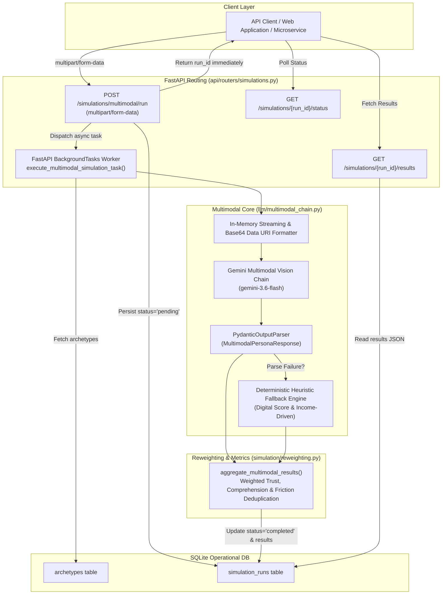

# Multimodal Vision & Creative Simulation: Backend Architecture & Workflow Specification

## 1. Executive Summary & Purpose

Indian consumers exhibit high visual sensitivity to marketing creatives, packaging aesthetics, and digital mobile interfaces. In non-metro and Tier-2/Tier-3 demographics, consumer trust is fragile: cluttered layouts, unfamiliar English jargon, unreadable terms, or overly slick graphics frequently trigger acute anxiety regarding online financial fraud or UPI scams.

The **Multimodal Vision & Creative Simulation Engine** is an API-first backend system that allows client applications to submit image creatives (marketing banners, packaging mockups, onboarding screens, mobile UI screenshots) alongside text value propositions. The backend evaluates these visual stimuli through **Google Gemini Multimodal Vision** conditioned on empirical demographic archetypes, measuring visual comprehension, visual trust vs. scam anxiety, first visual hooks, UI friction points, and social proof dynamics.

---

## 2. System Architecture & End-to-End Backend Workflow



---

## 3. Detailed Backend Operational Workflows

### Workflow 1: Multimodal Ingestion & In-Memory Streaming

**Primary Endpoint**: `POST /simulations/multimodal/run`  
**Backend Handler**: `start_multimodal_simulation()` in [`server/app/api/routers/simulations.py`](file:///c:/Users/Dell/Desktop/Market-Research/server/app/api/routers/simulations.py)

#### Step 1: Multipart Request Ingestion & MIME Validation
The router accepts `multipart/form-data` parameters:
* `creative_image`: `UploadFile` binary image file
* `stimulus_description`: `str` text proposition
* `category`: `str` industry sector (e.g., `Fintech`, `D2C`, `EdTech`)
* `population_run_id`: `str` target population UUID
* `use_social_influence`: `bool` flag for 2-pass social contagion
* `n_archetypes_override`: `Optional[int]` target archetypes limit (default: 4)

**Validation Guards**:
* **MIME Whitelist Check**:
  ```python
  supported_mime_types = ["image/png", "image/jpeg", "image/jpg", "image/webp"]
  if creative_image.content_type not in supported_mime_types:
      raise HTTPException(status_code=400, detail="Unsupported image type...")
  ```
* **Payload Verification**: Asserts `len(image_bytes) > 0`.
* **Demographic Baseline Check**: Verifies that archetypes exist in the database for `population_run_id`.

#### Step 2: In-Memory Byte Processing (Zero Disk Leaks)
To avoid lingering temporary files and platform-dependent I/O locks, the image bytes are read directly into memory:
```python
image_bytes = await creative_image.read()
```
The bytes and MIME type are passed directly to the worker task in memory.

#### Step 3: Persistence of Pending Run & Background Enqueue
* Inserts a `SimulationRun` record into the database with `status="pending"` and stimulus metadata:
  ```json
  {
    "description": "Daily digital gold savings starting at ₹10",
    "category": "Fintech",
    "population_run_id": "7b0a8806-0fc2-4fc8-9f20-802521c7ffcb",
    "has_multimodal_creative": true,
    "creative_filename": "creative_banner.jpg",
    "creative_mime_type": "image/jpeg"
  }
  ```
* Dispatches `execute_multimodal_simulation_task` using FastAPI `BackgroundTasks`.
* Returns an immediate HTTP 200 response with `run_id` and `status="pending"`.

---

### Workflow 2: Persona Computer Vision Simulation

**Worker Function**: `execute_multimodal_simulation_task()` in [`server/app/api/routers/simulations.py`](file:///c:/Users/Dell/Desktop/Market-Research/server/app/api/routers/simulations.py)  
**Execution Chain**: `run_multimodal_persona_simulation()` in [`server/app/llm/multimodal_chain.py`](file:///c:/Users/Dell/Desktop/Market-Research/server/app/llm/multimodal_chain.py)

#### Step 1: Demographic Context Framing
For each archetype, the worker compiles `PERSONA_SYSTEM_TEMPLATE`, strictly conditioning the model to act as a specific consumer segment:
```python
system_text = PERSONA_SYSTEM_TEMPLATE.format(
    state=archetype_attributes.get("state", "India"),
    urban_rural=archetype_attributes.get("rural_urban", "Urban"),
    income_band=archetype_attributes.get("income_bracket", "Middle"),
    age=archetype_attributes.get("age", 30),
    gender=archetype_attributes.get("gender", "Individual"),
    education=archetype_attributes.get("education_level", "Graduate"),
    occupation=archetype_attributes.get("occupation", "Worker"),
    digital_access_score=archetype_attributes.get("digital_access_score", 0.7),
    population_weight_pct=population_percentage,
)
```

#### Step 2: Base64 Data URI Assembly & Multimodal Payload Formatting
Converts binary image bytes into a Base64 data URI and packages it into LangChain message objects:
```python
base64_encoded_image = base64.b64encode(image_bytes).decode("utf-8")
image_data_uri = f"data:{mime_type};base64,{base64_encoded_image}"

messages = [
    SystemMessage(content=system_text),
    HumanMessage(
        content=[
            {"type": "text", "text": human_prompt},
            {"type": "image_url", "image_url": {"url": image_data_uri}},
        ]
    ),
]
```

#### Step 3: LLM Inference & Structured Parsing
* Passes messages to Google Gemini (`gemini-3.6-flash`).
* Evaluates visual cues against `MULTIMODAL_STIMULUS_TEMPLATE`:
  1. Purchase / adoption intent ($0–10$)
  2. Visual comprehension score ($0–10$): ease of grasping core benefit within 3 seconds
  3. Visual trust score ($0–10$): brand legitimacy vs. online scam/fraud fear
  4. First visual hook: copy or visual element that caught the eye first
  5. UI friction points: unreadable small text, English barrier, visual clutter
  6. Sentiment: `"positive" | "neutral" | "negative"`
  7. Primary objection / hesitation
  8. Authentic verbatim quote.
* Cleanses raw response of markdown code blocks (` ```json ... ``` `) and validates against `MultimodalPersonaResponse`.

#### Step 4: Deterministic Fallback Engine
If Gemini API limits or network drops occur, the engine triggers `generate_fallback_multimodal_response()`:
* Uses the archetype's `digital_access_score` and `income_band` to generate realistic heuristic responses:
  * Archetypes with digital access $< 0.4$ automatically flag English terminology barriers.
  * Low-income archetypes flag fee transparency and hidden recurring charge anxieties.

---

### Workflow 3: Multimodal Social Influence & Contagion

When `use_social_influence=True`, the worker executes a 2-pass social contagion workflow:

1. **Pass 1 (Isolated Visual Reaction)**:
   Archetypes inspect the visual creative independently without peer context.
2. **Peer Consensus Synthesis (`summarize_multimodal_peer_reactions`)**:
   Computes weighted visual trust, comprehension, and consolidates common peer objections:
   ```python
   peer_summary = (
       f"Average nationwide purchase intent was {weighted_intent:.1f}/10. "
       f"Average visual trust in this creative was {weighted_trust:.1f}/10. "
       f"Prominent peer concerns included: {common_objections}. "
       f"Key verbatim reactions: {quotes_summary}"
   )
   ```
3. **Pass 2 (Social Re-evaluation)**:
   Calls `run_multimodal_social_reevaluation()`, feeding `MULTIMODAL_SOCIAL_INFLUENCE_TEMPLATE` and the peer context summary back into Gemini alongside the image.
   Produces the final re-calibrated purchase intent, trust scores, and adjusted quotes.

---

### Workflow 4: Multimodal Aggregation & Reweighting

**Backend Handler**: `aggregate_multimodal_results()` in [`server/app/simulation/reweighting.py`](file:///c:/Users/Dell/Desktop/Market-Research/server/app/simulation/reweighting.py)

#### Step 1: Population-Weighted Score Computation
Computes frequency-weighted averages using archetype weights $w_k$:
$$\text{Weighted Visual Comprehension} = \frac{\sum_{k=1}^K w_k \cdot \text{Comprehension}_k}{\sum_{k=1}^K w_k}$$
$$\text{Weighted Visual Trust} = \frac{\sum_{k=1}^K w_k \cdot \text{Trust}_k}{\sum_{k=1}^K w_k}$$

#### Step 2: Extraction & Deduplication of Visual Anchors
Collects each archetype's `first_visual_hook` and deduplicates them into a clean array representing the top visual anchors that captured consumer attention.

#### Step 3: UI Friction Aggregation & Deduplication
Iterates through all archetypes' `ui_friction_points` arrays, filtering out duplicate strings and compiling an actionable list of design/language impediments.

#### Step 4: Database Persistence
* Appends aggregated metrics and individual archetype responses to `SimulationRun.results`.
* Sets `SimulationRun.status = "completed"` and commits the transaction.

---

### Workflow 5: Status Polling & Result Retrieval Contracts

#### 1. Polling Status
* **Endpoint**: `GET /simulations/{run_id}/status`
* **Response**:
  ```json
  {
    "run_id": "c3e98177-10d6-4e59-a5c9-cfa297da8211",
    "status": "completed"
  }
  ```

#### 2. Retrieving Multimodal Results
* **Endpoint**: `GET /simulations/{run_id}/results`
* **Response**:
  ```json
  {
    "run_id": "c3e98177-10d6-4e59-a5c9-cfa297da8211",
    "status": "completed",
    "results": {
      "population_purchase_intent": 6.75,
      "visual_comprehension_score": 7.42,
      "visual_trust_score": 7.15,
      "sentiment_distribution": {
        "positive": 0.65,
        "neutral": 0.25,
        "negative": 0.10
      },
      "first_visual_hooks": [
        "24K Gold Coin & ₹10 Daily Entry Point",
        "Trust Badges & Government Logo"
      ],
      "ui_friction_points": [
        "English-dominant terminology may feel unfamiliar in rural districts",
        "Fine print disclaimers unreadable on budget smartphones"
      ],
      "n_archetypes": 4,
      "archetype_details": [
        {
          "population_weight": 0.35,
          "purchase_intent": 7,
          "visual_comprehension_score": 8,
          "visual_trust_score": 7,
          "first_visual_hook": "24K Gold Coin",
          "ui_friction_points": ["English terms"],
          "sentiment": "positive",
          "objection": "Need assurance of instant bank withdrawals",
          "quote": "The ₹10 entry point looks appealing if withdrawals are immediate."
        }
      ]
    }
  }
  ```

---

## 4. Pydantic Schemas Reference

### `MultimodalPersonaResponse`
```python
class MultimodalPersonaResponse(BaseModel):
    purchase_intent: int = Field(ge=0, le=10, description="Adoption intent 0-10")
    visual_comprehension_score: int = Field(ge=0, le=10, description="Grasp of benefit in 3s")
    visual_trust_score: int = Field(ge=0, le=10, description="Brand legitimacy vs. scam anxiety")
    first_visual_hook: str = Field(description="First visual element that caught eye")
    ui_friction_points: List[str] = Field(default_factory=list, description="Confusing icons or small text")
    sentiment: str = Field(description="positive, neutral, or negative")
    objection: str = Field(description="Core concern or barrier")
    quote: str = Field(description="Verbatim vernacular quote")
```

---

## 5. Defensive Engineering & System Reliability

1. **In-Memory Streaming**: Binary files are never written to host disk during evaluation, eliminating temporary file leaks, file locking conflicts, and disk exhaustion.
2. **Robust JSON Sanitization**: Handles both raw JSON and fenced markdown (` ```json `) returned by vision LLM calls.
3. **Graceful Fallbacks**: In the event of upstream API throttling (HTTP 429), `generate_fallback_multimodal_response()` ensures the background job completes reliably without failing the overall simulation.
